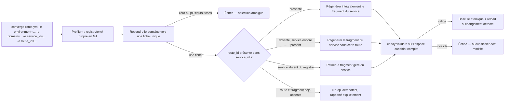
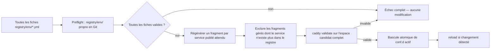

# Proposition d'architecture d'automatisation d'infrastructure

## Métadonnées

| Champ | Valeur |
| --- | --- |
| IA | Claude |
| Version | 0.3 — proposition candidate révisée |
| Date | 2026-08-02 |
| Projet | Rôle Ansible de gestion des reverse proxies Caddy (Repository Controller) |
| Type | Proposition d'architecture candidate révisée |
| Document précédent | 04D-proposition-architecture-reverse-proxy-claude-v0.2.md |
| Document de révision | Échange d'arbitrage humain du 2026-08-02 — arbitrages ARB-001 à ARB-009, clarifications A à R |

Ce document est autonome : il reprend intégralement la proposition 04D, corrigée et complétée par les décisions humaines confirmées lors de l'échange d'arbitrage du 2026-08-02. Il ne doit pas être lu comme un erratum ni comme un changelog. Toute section non explicitement révisée ci-dessous reste inchangée depuis 04D et n'est reprise que par référence.

---

# 1. Résumé exécutif

Le dépôt cible reste un dépôt spécialisé dans la gestion déclarative de deux reverse proxies Caddy (staging, production), sans interface web, API, base de données ni contrôleur permanent — fondé sur Git, YAML, Ansible et Caddy. La V1 est désormais explicitement restreinte aux systèmes **Debian et Ubuntu** ; SELinux est hors périmètre, la compatibilité AppArmor reste à vérifier.

Le modèle du registre est révisé en profondeur par rapport à 04D. Une fiche représente toujours un domaine (`domain`), mais elle déclare désormais un ou plusieurs **services publiés** (`published_services`), chacun caractérisé par un couple `listen_port` / `frontend_protocol` propre — ce qui permet de représenter nativement un cas comme la fédération Matrix (port 443 client et port 8448 fédération sur le même domaine) sans extension ad hoc. Chaque service publié contient une ou plusieurs **routes** (`routes`), chacune dotée d'un `handler` explicite (`reverse_proxy` ou `redirect`, mutuellement exclusifs) et, pour une route de type `reverse_proxy`, d'un ou plusieurs **backends** (`backends`). Le champ `redirects` au niveau racine de la fiche, présent dans 04D, est supprimé : une redirection est désormais une route comme une autre.

Le principe le plus structurant de cette révision est que **le rôle Ansible n'écrit jamais dans le registre Git, dans aucun cas** — ni pour un ajout, ni pour une modification, ni pour un retrait. Toute évolution du registre est un geste humain (édition, commit, push) ; les playbooks se limitent à faire converger l'état de Caddy vers l'état du registre déjà commité. Cette clarification unifie l'ajout et le retrait ciblés en un seul comportement observable, et réduit en conséquence l'interface publique du rôle à **deux playbooks** : `converge-proxy.yml` (convergence complète transactionnelle, remplace `deploy-reverse-proxy.yml`) et `converge-route.yml` (convergence ciblée sur un triplet `domain + service_id + route_id`, remplace à la fois `apply-route.yml` et `remove-route.yml` de 04D).

Le mécanisme de nettoyage des fragments orphelins, qui reposait dans 04D sur un simple en-tête « généré par Ansible », est renforcé par un nouveau principe d'architecture transverse : la **non-persistance des états dérivables**. Aucun index ni base auxiliaire ne recense les artefacts gérés sur la VM proxy : l'identité de chaque fragment Caddy (projet, service, ports, routes qu'il contient, commit source) est portée exclusivement par un en-tête auto-descriptif dans le fragment lui-même, régénéré à chaque exécution. Un journal de déploiement append-only reste disponible à des fins d'audit humain, mais ne participe jamais aux décisions du rôle. La granularité technique du fragment Caddy est le **service publié** (un fragment = un bloc de site Caddy `domain:port`, contenant toutes ses routes), et non la route individuelle, pour rester conforme au modèle de configuration de Caddy — l'identité documentaire d'une route (`project_name + service_id + route_id`) reste néanmoins entièrement vérifiable via l'en-tête du fragment qui la contient.

La distribution de la CA interne Caddy en staging est confirmée sous forme d'un **endpoint HTTP interne dédié** (`http://ca.<staging_base_domain>/root.crt`), consommé en pull par les rôles applicatifs. Le support HTTPS entre Caddy et les upstreams (backend HTTPS, CA personnalisée d'upstream) reste hors périmètre de la V1, malgré une discussion approfondie du sujet lors de l'arbitrage : la V1 conserve un transport `http` implicite et exclusif entre Caddy et ses backends.

---

# 2. Compréhension du besoin

## Problème actuel

Inchangé depuis 04D § 2 — le dépôt existant mélange configuration de routage et déploiement applicatif, sans mécanisme de ciblage d'un projet unique, avec un champ `domain` historiquement résolu de façon ambiguë selon l'inventaire chargé.

## Cible attendue

Un dépôt réduit à la seule gestion déclarative des deux reverse proxies Caddy, piloté par un registre versionné dans Git structuré en services publiés et routes, avec une capacité de convergence ciblée et complète strictement alignée sur l'état déclaré dans Git, sans qu'aucune opération automatisée ne modifie jamais ce registre.

## Objectifs

* réduire le dépôt central à une responsabilité unique (routage) ;
* rendre les applications et stacks autonomes vis-à-vis du dépôt central ;
* garantir qu'aucune opération (ciblée ou complète) ne peut faire diverger l'état appliqué sur la VM de l'état déclaré dans Git ;
* garantir que Git reste la seule source de vérité en écriture — aucun composant du système n'y écrit automatiquement ;
* représenter nativement les services à plusieurs ports d'écoute sur un même domaine (ex. fédération Matrix) sans extension ad hoc du modèle ;
* ne maintenir aucun état persistant reconstructible depuis Git et les artefacts générés ;
* conserver une séparation claire staging/production, avec un code de rôle commun.

## Exclusions

Interface web, API, base de données, contrôleur logiciel permanent, déploiement applicatif, health checks applicatifs, supervision, secrets applicatifs, gestion des VM/Proxmox, DNS public, pare-feu, WireGuard, distribution active de la CA staging par ce dépôt, support HTTPS entre Caddy et ses upstreams, écriture automatique du registre par un playbook (quel que soit le mode), promotion automatique staging → production, systèmes autres que Debian/Ubuntu.

## Contraintes humaines confirmées (version 0.3)

En plus des contraintes déjà confirmées dans les versions 0.1 et 0.2 (04A, 04B, 04D) et non révisées ci-dessous, les décisions suivantes issues de l'échange d'arbitrage du 2026-08-02 sont désormais des décisions humaines confirmées, avec priorité sur toute hypothèse ou proposition antérieure :

* une fiche déclare un ou plusieurs services publiés (`published_services`), chacun avec son propre `listen_port` et `frontend_protocol` ; ceci remplace le modèle « routes/upstreams » à plat de 04D ;
* chaque service publié contient une ou plusieurs routes, chacune avec un `handler` (`reverse_proxy` ou `redirect`) ; le champ `redirects` racine de 04D est supprimé ;
* le transport Caddy → backend reste implicitement et exclusivement `http` en V1 ; aucun champ `protocol` n'existe au niveau des backends ;
* aucun playbook du rôle `reverse_proxy` ne crée, ne modifie ni ne supprime un fichier du registre Git, dans aucun mode d'exécution ;
* l'ajout et le retrait ciblés sont fusionnés en un unique playbook `converge-route.yml`, adressé par `domain + service_id + route_id`, avec un comportement PRESENT/ABSENT/no-op/ambigu ;
* la convergence complète est portée par `converge-route.yml`'s pendant global, `converge-proxy.yml` ;
* aucun index persistant des artefacts gérés n'est maintenu sur la VM proxy ; l'identité des fragments repose exclusivement sur un nommage déterministe et un en-tête auto-descriptif ;
* la granularité technique du fragment Caddy est le service publié (un fragment = un bloc de site `domain:port`), et non la route individuelle ;
* une vérification de propreté Git (`git status --porcelain`) sur l'intégralité de `registry/<environment>/` est une précondition exécutable et bloquante de toute convergence, ciblée ou complète, sans option de contournement ;
* un journal de déploiement append-only est conservé à des fins d'audit humain, hors de la VM proxy, mais ne participe jamais aux décisions du rôle ;
* le certificat `root.crt` est distribué via un endpoint HTTP interne dédié (`http://ca.<staging_base_domain>/root.crt`), et non via `fetch`/`slurp` Ansible ;
* le support HTTPS entre Caddy et les upstreams (y compris une CA personnalisée d'upstream) reste hors périmètre de la V1 ;
* le champ `stack_name` n'est pas retenu ;
* la V1 supporte exclusivement Debian et Ubuntu ; SELinux est hors périmètre ; la compatibilité AppArmor reste à vérifier ;
* `deploy-matrix-stack.yml` et le contenu réel du rôle `element_web` sont explicitement hors du contrat du Control Repository, qui ne dépend que du contrat d'exposition (domaine, services, ports, backends) documenté dans le registre ;
* il n'existe aucun mécanisme de promotion automatique staging → production ; la production est une instanciation séparée et volontairement manuelle du modèle documentaire.

---

# 3. Périmètre architectural

## 3.1 Dans le périmètre

* installation initiale de Caddy sur les VM proxy Debian/Ubuntu (staging, production) ;
* configuration globale de Caddy (fichier principal, répertoire `conf.d/`) ;
* registre central des domaines et services routables, versionné dans Git, organisé par environnement ;
* génération, mise à jour et retrait d'un fragment de service, toujours validés dans un espace candidat complet ;
* validation de la configuration Caddy avant toute activation ;
* reload gracieux de Caddy ;
* convergence complète et transactionnelle d'une VM proxy depuis le registre ;
* convergence ciblée d'un service à partir d'une route identifiée ;
* gestion de la CA interne Caddy en staging (persistance, mise à disposition du certificat public via un endpoint HTTP dédié) ;
* gestion automatique des certificats publics en production (ACME, via Caddy) ;
* vérification exécutable de la propreté du registre Git avant toute convergence.

## 3.2 Hors périmètre

* déploiement, mise à jour ou suppression des conteneurs applicatifs ;
* images Docker, volumes, bases de données et sauvegardes applicatives ;
* secrets applicatifs ;
* health checks applicatifs et supervision/monitoring ;
* DNS public, pare-feu, WireGuard ;
* création des VM, Proxmox ;
* distribution active de la CA staging vers les VM clientes (modèle pull uniquement, § 10.2) ;
* sauvegarde du stockage persistant de Caddy (dépendance opérationnelle documentée, non implémentée par ce rôle, § 10.4) ;
* support HTTPS entre Caddy et ses upstreams, y compris toute notion de CA personnalisée d'upstream (nouveau, révision 0.3 — un besoin réel exigerait une nouvelle version du schéma et une décision d'architecture dédiée) ;
* toute écriture automatique du registre Git par un playbook, dans quelque mode que ce soit (nouveau, révision 0.3) ;
* tout index ou état persistant des artefacts gérés sur la VM proxy (nouveau, révision 0.3, § 8.7) ;
* systèmes d'exploitation autres que Debian/Ubuntu (nouveau, révision 0.3) ;
* promotion automatique staging → production ;
* toute logique métier propre à une application.

## 3.3 Frontières avec les autres dépôts

| Frontière | Contrat |
| --- | --- |
| Control Repository ↔ dépôts applicatifs (routage) | Le dépôt applicatif documente ses besoins de routage ; **l'opérateur humain** modifie le registre `reverse_proxy` en conséquence (commit Git), puis exécute `converge-route.yml` ou `converge-proxy.yml`. Aucun playbook n'écrit jamais dans le registre. |
| Control Repository ↔ dépôts applicatifs (CA staging) | Le Control Repository expose `root.crt` via un endpoint HTTP interne dédié en staging. Le rôle applicatif consommateur le récupère par requête HTTP et l'installe selon ses propres besoins (§ 10.2). |
| Control Repository ↔ rôles applicatifs Matrix / Element Web | Le Control Repository ne dépend que du contrat d'exposition déclaré dans le registre (domaine, services, ports, backends). Le contenu réel, l'existence ou l'implémentation des playbooks/rôles applicatifs sous-jacents (`deploy-matrix-stack.yml`, `element_web`) ne conditionnent jamais une décision du modèle documentaire du reverse proxy. |
| Control Repository ↔ système de monitoring | Hors périmètre. |
| Control Repository ↔ infrastructure réseau | Le dépôt suppose des VM proxy Debian/Ubuntu déjà créées et un réseau déjà en place. |
| Control Repository ↔ opérateur humain | Toute opération est déclenchée explicitement par une commande `ansible-playbook`. Le registre est un artefact Git exclusivement modifié par l'opérateur ; aucun playbook ne le modifie. |
| Control Repository ↔ sauvegarde infrastructure | La conservation de l'identité TLS (CA staging, comptes ACME) dépend d'une sauvegarde du stockage persistant Caddy, gérée par un mécanisme de sauvegarde externe à ce dépôt (§ 10.4). |
| Control Repository ↔ production | La production est une instanciation manuelle et séparée du modèle documentaire ; aucun mécanisme de promotion automatique depuis staging n'existe. |

---

# 4. Vue d'ensemble de l'architecture

## Composants

* **Registre** (`registry/staging/*.yml`, `registry/production/*.yml`) : source de vérité déclarative du routage, une fiche par domaine et par environnement, structurée en services publiés, routes et backends.
* **Inventaires** (`inventories/staging/`, `inventories/production/`) : hôtes proxy, variables d'environnement.
* **Rôle `reverse_proxy`** : installe/configure Caddy, vérifie la propreté du registre Git, construit un espace candidat, valide, applique atomiquement, recharge. Ne modifie jamais le registre.
* **Playbooks** : `converge-proxy.yml` (convergence complète, transactionnelle) et `converge-route.yml` (convergence ciblée d'un service à partir d'une route, PRESENT/ABSENT/no-op).
* **Caddy** : fichier principal + fragments sous `/etc/caddy/conf.d/`, un fragment par service publié.

## Flux de convergence ciblée (`converge-route.yml`)



## Flux de convergence complète (`converge-proxy.yml`)



Ces deux flux remplacent intégralement ceux de 04D § 4 (flux d'ajout ciblé, de convergence complète et de suppression ciblée) : la distinction ajout/suppression ciblés disparaît au niveau du playbook, absorbée par le comportement PRESENT/ABSENT unifié de `converge-route.yml`.

---

# 5. Structure proposée du dépôt

```text
Control Repository
├── inventories/
│   ├── staging/
│   │   ├── hosts.yml
│   │   └── group_vars/
│   │       └── proxy.yml
│   └── production/
│       ├── hosts.yml
│       └── group_vars/
│           └── proxy.yml
│
├── registry/
│   ├── staging/
│   │   ├── www-lavallee.yml
│   │   ├── keycloak.yml
│   │   ├── nextcloud.yml
│   │   ├── facturier.yml
│   │   └── matrix.yml
│   └── production/
│       └── (même liste de fiches)
│
├── playbooks/
│   ├── converge-proxy.yml
│   └── converge-route.yml
│
├── roles/
│   └── reverse_proxy/
│       ├── defaults/
│       ├── tasks/
│       │   ├── main.yml               (point d'entrée converge-proxy)
│       │   ├── converge_route.yml     (point d'entrée converge-route)
│       │   ├── preflight.yml          (propreté Git, nouveau en 0.3)
│       │   ├── install.yml
│       │   ├── registry_load.yml
│       │   ├── fragment_render.yml    (rendu d'un fragment de service, nouveau en 0.3)
│       │   ├── candidate_build.yml
│       │   ├── candidate_validate.yml
│       │   └── candidate_apply.yml
│       ├── handlers/
│       ├── templates/
│       │   ├── Caddyfile.j2
│       │   └── fragment.caddy.j2
│       └── meta/
│
├── schemas/
│   └── registry-entry.schema.json
│
├── tests/
│
└── README.md
```

| Élément | Responsabilité | Source de vérité | Généré ou versionné |
| --- | --- | --- | --- |
| `inventories/` | Hôtes proxy, variables d'environnement | Humaine | Versionné |
| `registry/staging/`, `registry/production/` | État attendu du routage, par environnement | Humaine (via Git, jamais via un playbook) | Versionné |
| `playbooks/` | Points d'entrée opérationnels (2 seulement) | Humaine | Versionné |
| `roles/reverse_proxy/tasks/preflight.yml` | Vérification exécutable de la propreté Git du registre | Humaine | Versionné |
| `roles/reverse_proxy/tasks/install.yml` | Installation/configuration globale de Caddy | Humaine | Versionné |
| `roles/reverse_proxy/tasks/converge_route.yml` | Convergence ciblée, sans passer par l'installation | Humaine | Versionné |
| `schemas/` | Contrat de validation du registre | Humaine | Versionné |
| `/etc/caddy/Caddyfile` (VM) | Fichier principal, import de `conf.d/` | Généré depuis un template statique | Généré, non versionné |
| `/etc/caddy/conf.d/<project_name>__<service_id>.caddy` (VM) | Un fragment par service publié actif, en-tête auto-descriptif | Généré depuis `registry/` | Généré, non versionné, auto-descriptif |
| `/etc/caddy/candidate/` (VM) | Espace de construction et de validation, éphémère | Généré à chaque exécution | Non versionné, non persistant |
| `/var/lib/caddy/.local/share/caddy/pki/...` (VM) | CA interne staging, certificats | Géré par Caddy | Non versionné, **sauvegarde externe requise** (§ 10.4) |
| Aucun index d'artefacts gérés | — (supprimé en révision 0.3) | — | N'existe pas ; identité portée par le nom de fichier et l'en-tête de chaque fragment |

---

# 6. Modèle du registre central

## 6.1 Unité de déclaration retenue

L'unité documentaire reste **la fiche = un domaine** (inchangé depuis 04D § 6.1, confirmé par l'arbitrage ARB-001). Une fiche ne représente ni un port, ni une route HTTP isolée, ni un endpoint technique : elle représente un domaine fonctionnel, qui peut publier plusieurs services techniques.

Cette révision précise ARCH-CAND-001 (04D) : la version 0.2 reconnaissait déjà qu'un domaine pouvait porter plusieurs routes ; la version 0.3 introduit un niveau intermédiaire explicite — le **service publié** — entre le domaine et ses routes, pour représenter nativement les cas à plusieurs ports d'écoute (Matrix) sans détourner le modèle de route.

## 6.2 Organisation par environnement

Inchangé depuis 04D § 6.2 :

```text
registry/staging/<project_name>.yml
registry/production/<project_name>.yml
```

Le champ `environment` n'existe pas dans la fiche ; l'environnement est déterminé sans ambiguïté par le sous-répertoire chargé, lui-même dérivé automatiquement de `environment_name`. `project_name` est unique au sein d'un même sous-répertoire d'environnement, et le nom du fichier YAML doit correspondre exactement à cette valeur (`registry/<environment>/<project_name>.yml`) — un nom de fichier divergent du `project_name` déclaré à l'intérieur est une erreur de validation.

## 6.3 Schéma conceptuel

```text
Fiche de registre (registry/<environnement>/<project_name>.yml)
 ├── project_name (identifiant canonique, unique par environnement)
 ├── domain (FQDN unique, ex. matrix.example.org)
 └── published_services[] (au moins un)
       ├── service_id (unique dans la fiche)
       ├── listen_port
       ├── frontend_protocol (http | https)
       └── routes[] (au moins un)
             ├── route_id (unique dans le service)
             ├── path (défaut "/")
             ├── handler (reverse_proxy | redirect)
             ├── strip_prefix (défaut false, uniquement si handler = reverse_proxy)
             ├── backends[] (obligatoire et non vide si handler = reverse_proxy ; interdit si handler = redirect)
             │     ├── backend_id (unique dans la route)
             │     ├── host
             │     └── target_port      (transport implicite http, aucun champ protocol)
             └── redirect                (obligatoire si handler = redirect ; interdit si handler = reverse_proxy)
                   ├── target
                   └── status_code
```

Le champ `redirects` au niveau racine de la fiche (04D § 6.6, exemple Nextcloud § 6.11.3) est supprimé : une redirection est désormais une route à part entière, portée par `handler: redirect`.

## 6.4 Distinction service / route / backend

Trois niveaux, chacun avec une responsabilité propre :

* **Un service publié** décrit un point d'entrée réseau du reverse proxy pour ce domaine : un port d'écoute (`listen_port`) et un protocole frontal (`frontend_protocol`). Il correspond, techniquement, à un unique bloc de site Caddy (`domain:listen_port { }`).
* **Une route** décrit un comportement à l'intérieur d'un service : un chemin (`path`), un `handler`, et selon ce handler soit un ou plusieurs backends, soit une redirection.
* **Un backend** décrit une cible concrète d'un `reverse_proxy` : hôte et port, joints en HTTP.

```yaml
published_services:
  - service_id: web
    listen_port: 443
    frontend_protocol: https
    routes:
      - route_id: application
        path: /app/*
        handler: reverse_proxy
        strip_prefix: true
        backends:
          - backend_id: primary
            host: 192.168.1.20
            target_port: 18081
```

**Ordre d'évaluation** : inchangé depuis 04D § 6.4 — les routes sont rendues dans l'ordre déclaré dans `routes[]` de leur service. Une route générique (`path: /`) agissant comme repli doit être déclarée après les routes plus spécifiques : le rôle ne réordonne jamais automatiquement les routes par spécificité. Convention de rédaction documentée dans le `README.md`.

## 6.5 Champs obligatoires

| Champ | Type | Description | Consommateur |
| --- | --- | --- | --- |
| `project_name` | string | Identifiant canonique du projet ; radical du fichier YAML et clé de nommage des fragments | rôle `reverse_proxy`, playbooks |
| `domain` | string | FQDN complet exposé par Caddy (ex. `matrix.example.org`) | résolution de `converge-route.yml`, template Caddy |
| `published_services` | list(objet), ≥ 1 | Au moins un service publié | template Caddy |
| `published_services[].service_id` | string | Identifiant du service, unique dans la fiche | nommage de fragment, adressage ciblé |
| `published_services[].listen_port` | integer | Port d'écoute du service | template Caddy |
| `published_services[].frontend_protocol` | string, `http`\|`https` | Protocole entre le client et Caddy pour ce service | template Caddy |
| `published_services[].routes` | list(objet), ≥ 1 | Au moins une route par service | template Caddy |
| `routes[].route_id` | string | Identifiant de la route, unique dans son service | adressage ciblé, en-tête de fragment |
| `routes[].handler` | string, `reverse_proxy`\|`redirect` | Comportement de la route | template Caddy |
| `routes[].backends` | list(objet), ≥ 1 si `handler = reverse_proxy` ; interdit sinon | Au moins un `{backend_id, host, target_port}` | template Caddy |
| `routes[].redirect` | objet, obligatoire si `handler = redirect` ; interdit sinon | `{target, status_code}` | template Caddy |
| `backends[].backend_id` | string | Identifiant du backend, unique dans sa route | documentation, futures opérations ciblées sur backend |
| `backends[].host` | string | Adresse ou nom résolvable depuis la VM proxy ; n'est jamais résolu via l'inventaire Ansible | template Caddy |
| `backends[].target_port` | integer | Port du backend | template Caddy |

## 6.6 Champs facultatifs et valeurs par défaut

| Champ | Valeur par défaut | Description |
| --- | --- | --- |
| `routes[].path` | `/` | Chemin routé |
| `routes[].strip_prefix` | `false` | Retire le préfixe de chemin avant transmission au backend ; uniquement significatif si `handler = reverse_proxy` |

**Champs explicitement supprimés ou non retenus par rapport à 04D** :

* `subdomain`, `environment`, `listen_port` (au niveau racine, remplacé par `published_services[].listen_port`), `tls_mode` (par fiche), `headers`, `websocket` — tous restent absents pour les mêmes raisons que 04D § 6.6 ;
* `enabled` — non retenu ; la suppression physique de l'entrée dans le registre reste l'unique mécanisme de retrait (§ 9.4), confirmé par ARB-002 ;
* `redirects` (racine de fiche) — supprimé, remplacé par `handler: redirect` par route (§ 6.9) ;
* `stack_name` — non retenu (ARB-005), sans reconduction en question ouverte : le regroupement de fiches reste assuré par la convention de nommage et l'organisation du dépôt Git.

## 6.7 Encadrement du transport backend

Le transport entre Caddy et un backend `reverse_proxy` reste **implicitement et exclusivement HTTP** en V1 (confirmation de DEC-017/ARCH-CAND-020 de 04D, close par la clarification D de l'arbitrage). Aucun champ `protocol` n'existe au niveau `backends[]` : son absence est intentionnelle, pas une omission. Une extension HTTPS-upstream nécessiterait de définir la validation du certificat backend, le nom TLS attendu, et le stockage d'une éventuelle CA personnalisée — elle est explicitement reportée à une décision d'architecture ultérieure et dédiée (§ 3.2), et non traitée comme une simple question ouverte de cette version.

## 6.8 Absence de champ WebSocket

Inchangé depuis 04D § 6.8 — Caddy gère nativement le WebSocket via `reverse_proxy`, aucun champ dédié n'est introduit.

## 6.9 Handler de route : `reverse_proxy` ou `redirect`

Chaque route déclare exactement un `handler` :

* **`reverse_proxy`** : `backends[]` est obligatoire et non vide ; `redirect` est interdit ; `strip_prefix` est utilisable.
* **`redirect`** : le bloc `redirect` (`target`, `status_code`) est obligatoire ; `backends[]` est interdit ; `strip_prefix` n'est pas applicable.

Cette distinction remplace le champ `redirects` racine de 04D, qui traitait les redirections comme un mécanisme séparé du modèle route/upstream.

## 6.10 FQDN unique, sans composition implicite

Inchangé depuis 04D § 6.9 : chaque fiche déclare le FQDN exact et complet dans le seul champ `domain`. Aucune reconstruction implicite n'est effectuée. `domain` n'est pas formellement garanti unique par le schéma à l'échelle de l'environnement (deux fiches pourraient en théorie déclarer le même domaine), mais `converge-route.yml` échoue explicitement si la résolution d'un `domain` fourni en paramètre correspond à zéro ou plusieurs fiches (§ 9.3) — l'unicité effective du domaine est donc une précondition opérationnelle de la convergence ciblée, vérifiée à l'exécution plutôt qu'imposée a priori par le schéma.

## 6.11 Format des identifiants et invariants d'unicité

`project_name`, `service_id`, `route_id` et `backend_id` sont restreints à un format `[a-z0-9-]+` (minuscules ASCII, chiffres, tirets — **le caractère `_` est explicitement interdit** dans ces quatre champs, condition nécessaire à un nommage de fragment sans ambiguïté, § 8.3).

Invariants d'unicité, tous vérifiés à la validation du registre :

* `project_name` unique au sein d'un même sous-répertoire d'environnement ;
* `service_id` unique au sein d'une fiche ;
* le couple `(frontend_protocol, listen_port)` unique au sein d'une fiche — deux services partageant le même protocole frontal et le même port doivent être fusionnés en un seul service à plusieurs routes ;
* `route_id` unique au sein d'un service ;
* `backend_id` unique au sein d'une route.

Le triplet `project_name + service_id + route_id` est donc unique à l'échelle de l'environnement, et sert d'identité documentaire canonique d'une route (§ 8.3).

## 6.12 Exemples

### 6.12.1 Site simple

```yaml
# registry/production/www-lavallee.yml
project_name: www-lavallee
domain: www.lavallee.tech

published_services:
  - service_id: web
    listen_port: 443
    frontend_protocol: https
    routes:
      - route_id: default
        path: /
        handler: reverse_proxy
        backends:
          - backend_id: primary
            host: 10.10.0.10
            target_port: 8080
```

### 6.12.2 Application sur sous-domaine (Keycloak)

```yaml
# registry/staging/keycloak.yml
project_name: keycloak
domain: keycloak.lavallee.tech

published_services:
  - service_id: web
    listen_port: 443
    frontend_protocol: https
    routes:
      - route_id: default
        path: /
        handler: reverse_proxy
        backends:
          - backend_id: primary
            host: 192.168.1.40
            target_port: 8080
```

L'équivalent production est une fiche distincte `registry/production/keycloak.yml`.

### 6.12.3 Nextcloud, redirections modélisées comme routes

```yaml
# registry/production/nextcloud.yml
project_name: nextcloud
domain: cloud.lavallee.tech

published_services:
  - service_id: web
    listen_port: 443
    frontend_protocol: https
    routes:
      - route_id: webdav-carddav
        path: /.well-known/carddav
        handler: redirect
        redirect:
          target: /remote.php/dav
          status_code: 301
      - route_id: webdav-caldav
        path: /.well-known/caldav
        handler: redirect
        redirect:
          target: /remote.php/dav
          status_code: 301
      - route_id: default
        path: /
        handler: reverse_proxy
        backends:
          - backend_id: primary
            host: 10.10.0.50
            target_port: 8080
```

Les routes spécifiques (`/.well-known/...`) précèdent la route générique (`/`), conformément à § 6.4.

### 6.12.4 Facturier — multi-route sur un même service

```yaml
# registry/production/facturier.yml
project_name: facturier
domain: facturier.lavallee.tech

published_services:
  - service_id: web
    listen_port: 443
    frontend_protocol: https
    routes:
      - route_id: application
        path: /app/*
        handler: reverse_proxy
        strip_prefix: true
        backends:
          - backend_id: primary
            host: 192.168.1.20
            target_port: 18081

      - route_id: api
        path: /api/*
        handler: reverse_proxy
        strip_prefix: false
        backends:
          - backend_id: primary
            host: 192.168.1.20
            target_port: 18081

      - route_id: landing
        path: /
        handler: reverse_proxy
        strip_prefix: false
        backends:
          - backend_id: primary
            host: 192.168.1.20
            target_port: 18080
```

Les champs de déploiement applicatif (`target_group`, `image`, `container_port`, `healthcheck_url`, `docker_environment`, `volumes`, etc.) ne sont pas repris : ils relèvent exclusivement du dépôt applicatif de Facturier.

### 6.12.5 Service multi-backend (répartition de charge)

```yaml
# registry/staging/application-cluster.yml
project_name: application-cluster
domain: application.staging.local

published_services:
  - service_id: web
    listen_port: 443
    frontend_protocol: https
    routes:
      - route_id: default
        path: /
        handler: reverse_proxy
        backends:
          - backend_id: node-1
            host: 192.168.1.61
            target_port: 8080
          - backend_id: node-2
            host: 192.168.1.62
            target_port: 8080
```

### 6.12.6 Matrix — service à deux ports d'écoute, désormais représentable nativement

```yaml
# registry/staging/matrix.yml
project_name: matrix
domain: matrix.example.org

published_services:
  - service_id: matrix-client
    listen_port: 443
    frontend_protocol: https
    routes:
      - route_id: default
        path: /
        handler: reverse_proxy
        backends:
          - backend_id: matrix-1
            host: 10.10.20.11
            target_port: 8008
          - backend_id: matrix-2
            host: 10.10.20.12
            target_port: 8008

  - service_id: matrix-federation
    listen_port: 8448
    frontend_protocol: https
    routes:
      - route_id: default
        path: /
        handler: reverse_proxy
        backends:
          - backend_id: matrix-1
            host: 10.10.20.11
            target_port: 8448
          - backend_id: matrix-2
            host: 10.10.20.12
            target_port: 8448
```

Cet exemple ferme définitivement la question ouverte Q-001 de 04D : la fédération Matrix est représentée par un second `published_service` sur le même domaine, sans extension ad hoc du modèle de route, conformément à ARB-001.

## 6.13 Validation du registre

* validation de forme (YAML bien formé) via `yamllint` en amont (CI ou pré-commit) ;
* validation de schéma (présence des champs obligatoires, types, tous les invariants d'unicité de § 6.11, exclusivité `backends`/`redirect` selon `handler`, format `[a-z0-9-]+` des identifiants, correspondance nom de fichier / `project_name`) via `ansible.builtin.assert`, complétée par un schéma JSON Schema en CI ;
* le schéma ne connaît et ne contrôle que les champs de routage définis en § 6.5/6.6 ; la présence d'un champ de déploiement applicatif dans une fiche `registry/` est une erreur de validation, pas une donnée tolérée ;
* une fiche incomplète ou invalide ne doit produire ni fragment ni reload : en mode ciblé, l'opération échoue avant tout rendu ; en mode convergence complète, **l'ensemble de l'opération échoue** (§ 9.4) — aucune application partielle n'est tolérée.

---

# 7. Architecture du rôle Ansible

## 7.1 Responsabilités

* installation initiale de Caddy sur Debian/Ubuntu (paquets, service systemd) ;
* configuration globale de Caddy (fichier principal, répertoire `conf.d/`) ;
* vérification exécutable de la propreté Git du registre avant toute convergence (§ 7.3) ;
* chargement et validation d'une ou plusieurs fiches du registre ;
* résolution d'un `domain` fourni en paramètre vers une fiche unique, pour `converge-route.yml` ;
* construction d'un espace de configuration candidat complet reflétant l'état visé ;
* validation de cet espace candidat (`caddy validate`) avant toute application ;
* bascule atomique de la configuration active ;
* reload gracieux conditionné à une validation réussie ;
* détection et exclusion des fragments gérés devenus orphelins, par lecture de leur en-tête (§ 8.6) ;
* création/persistance de la CA interne Caddy en staging ;
* exposition du certificat public de cette CA via un endpoint HTTP interne dédié (§ 10.2).

## 7.2 Non-responsabilités

* ne réinstalle jamais une application ;
* ne redémarre jamais brutalement Caddy ;
* n'exécute aucun rôle applicatif ;
* n'effectue aucun health check applicatif ;
* ne distribue jamais activement la confiance CA aux VM clientes — il l'expose seulement via un endpoint pull (§ 10.2) ;
* ne gère aucun secret applicatif ;
* n'écrit **jamais** dans le registre — ni le sien, ni celui d'un autre dépôt, dans **aucun** mode d'exécution (renforcement de 04D § 7.2, désormais absolu et non limité aux dépôts tiers) ;
* ne maintient aucun index ou état persistant des artefacts gérés (nouveau, § 8.7) ;
* ne configure ni ne vérifie de transport HTTPS vers un backend.

## 7.3 Sous-composants

Cette section révise l'organisation interne du rôle décrite en 04D § 7.3 : un point d'entrée de préflight est ajouté, les deux points d'entrée ciblés (`targeted_apply`/`targeted_remove`) fusionnent en un seul (`converge_route`), et un composant de rendu de fragment est isolé (nécessaire aux deux playbooks, puisqu'un fragment couvre désormais toutes les routes d'un service).

| Fichier de tâches | Rôle | Appelé par |
| --- | --- | --- |
| `tasks/preflight.yml` | Vérifie que `registry/{{ environment_name }}/` est un répertoire Git sans modification indexée, non indexée ni fichier non suivi (`git status --porcelain=v1 --untracked-files=all`) ; enregistre le SHA de `HEAD` consommé | tous les points d'entrée |
| `tasks/install.yml` | Installation et configuration globale de Caddy (paquets, service, fichier principal statique) | `main.yml` uniquement |
| `tasks/registry_load.yml` | Chargement et validation d'une ou plusieurs fiches ; résolution `domain → project_name` pour le mode ciblé | tous les points d'entrée |
| `tasks/fragment_render.yml` | Rendu complet d'un fragment de service (toutes ses routes courantes) avec en-tête auto-descriptif (§ 8.3) | `candidate_build.yml`, dans les deux modes |
| `tasks/candidate_build.yml` | Construction de l'espace candidat complet (copie de l'actif + fragments régénérés) | `main.yml`, `converge_route.yml` |
| `tasks/candidate_validate.yml` | `caddy validate` sur l'espace candidat | `main.yml`, `converge_route.yml` |
| `tasks/candidate_apply.yml` | Bascule atomique de l'espace candidat vers l'actif, reload conditionnel | `main.yml`, `converge_route.yml` |
| `tasks/converge_route.yml` | Point d'entrée ciblé : préflight → résolution du domaine → détermination PRESENT/ABSENT/no-op → régénération du fragment de service concerné → candidat → validation → application | `converge-route.yml` |
| `tasks/main.yml` | Point d'entrée de convergence complète transactionnelle : préflight → install → charge toutes les fiches → régénère tous les fragments attendus → exclut les orphelins → candidat → validation → application | `converge-proxy.yml` |

## 7.4 Variables d'entrée

| Variable | Portée | Description |
| --- | --- | --- |
| `caddy_tls_mode` | inventaire (staging/production) | `internal` ou `acme` |
| `caddy_acme_email` | inventaire (production) | Contact ACME |
| `caddy_conf_d_dir` | rôle (défaut commun) | `/etc/caddy/conf.d/` |
| `caddy_candidate_dir` | rôle (défaut commun) | Répertoire de construction/validation éphémère |
| `registry_path` | dérivé automatiquement | `registry/{{ environment_name }}/`, jamais fourni manuellement |
| `staging_ca_endpoint_domain` | inventaire (staging) | Domaine de base servant l'endpoint `root.crt` (§ 10.2) |
| `environment` | fourni en `-e` (`converge-route.yml`) | Environnement ciblé, doit correspondre à l'inventaire chargé |
| `domain` | fourni en `-e` (`converge-route.yml`) | Domaine de la fiche à résoudre |
| `service_id` | fourni en `-e` (`converge-route.yml`) | Service publié ciblé |
| `route_id` | fourni en `-e` (`converge-route.yml`) | Route ciblée au sein du service |

Aucune variable `proxy_project` n'est fournie directement pour le mode ciblé : `project_name` est résolu par le rôle à partir de `domain`, jamais donné en paramètre par l'opérateur (§ 9.3).

## 7.5 Résultats et effets produits

* paquets Caddy installés, service actif ;
* fichier principal Caddy, répertoire `conf.d/` ;
* un fragment `.caddy` par service publié actif du registre pour l'environnement courant, chacun auto-descriptif ;
* configuration Caddy toujours validée dans un espace candidat avant toute activation ;
* CA interne Caddy initialisée et persistée en staging ;
* `root.crt` disponible via l'endpoint HTTP interne dédié en staging ;
* aucun fichier d'état ou d'index créé sur la VM proxy en dehors des fragments Caddy eux-mêmes.

## 7.6 Idempotence

Inchangé dans son principe depuis 04D § 7.6 : une seconde exécution sans changement de registre ni d'inventaire ne modifie aucun fichier actif et ne déclenche aucun reload. Pour `converge-route.yml`, le cas « route et fragment déjà absents » est un no-op explicitement rapporté, distinct d'un échec.

---

# 8. Architecture de la configuration Caddy

## 8.1 Stratégie retenue

Inchangé depuis 04D § 8.1 : répertoire modulaire `conf.d`.

## 8.2 Fichier principal

Inchangé depuis 04D § 8.2 :

```caddyfile
{
    email admin@example.com
}

import /etc/caddy/conf.d/*.caddy
```

## 8.3 Fragments de service et nommage déterministe

Cette section remplace intégralement 04D § 8.3.

**Granularité** : un fragment Caddy par **service publié**, et non par route. Un service publié correspond à un unique bloc de site Caddy (`domain:listen_port { }`) ; Caddy n'admet pas deux blocs de site séparés déclarant la même adresse, ce qui interdit de facto un fragment par route (une fiche à plusieurs routes sur un même service produirait alors des adresses de site dupliquées).

**Nom de fragment** :

```text
<project_name>__<service_id>.caddy
```

Le séparateur `__` est sans ambiguïté car `project_name` et `service_id` sont restreints à `[a-z0-9-]+` (§ 6.11) : le caractère `_` y est interdit, il ne peut donc jamais apparaître à l'intérieur de l'un ou l'autre segment. Combinée aux invariants d'unicité de § 6.11 (`project_name` unique par environnement, `service_id` unique par fiche), cette convention garantit l'unicité du nom de fragment **sans troncature ni suffixe de hachage** : toute violation de format ou de longueur excessive est un échec de validation du registre (§ 6.13), jamais une normalisation silencieuse.

**Contenu du fragment** : un unique bloc `domain:listen_port { }`, contenant un `handle`/`route` par entrée de `routes[]` du service, dans l'ordre déclaré (§ 6.4). Une route `handler: reverse_proxy` produit un bloc `reverse_proxy` vers ses backends (répartition de charge native si plusieurs backends) ; une route `handler: redirect` produit une directive `redir` vers `redirect.target` avec le code `redirect.status_code`.

## 8.4 En-tête auto-descriptif

Chaque fragment généré porte, en commentaires Caddyfile, un en-tête machine-lisible constituant son identité complète — remplaçant tout index externe :

```caddyfile
# ------------------------------------------------------------
# managed-by: ansible-role-reverse-proxy
# schema-version: 1
# project-name: facturier
# domain: facturier.lavallee.tech
# service-id: web
# listen-port: 443
# frontend-protocol: https
# route-id: application
# route-id: api
# route-id: landing
# source-commit: 4f2a1e9
# generated-at: 2026-08-02T15:42:11Z
#
# DO NOT EDIT — généré depuis registry/production/facturier.yml
# ------------------------------------------------------------
```

Champs obligatoires : `managed-by`, `schema-version`, `project-name`, `domain`, `service-id`, `listen-port`, `frontend-protocol`, une ligne `route-id` répétée par route contenue dans le fragment au moment de sa génération, `source-commit` (SHA `HEAD` consommé, § 7.3), `generated-at`.

Cet en-tête remplit trois rôles à la fois :

* **distinction géré/non géré** : un fichier `.caddy` sans la ligne `managed-by: ansible-role-reverse-proxy` n'est jamais touché par le rôle, ni lu, ni supprimé, ni considéré comme orphelin (inchangé dans le principe depuis ARCH-CAND-007, 04D) ;
* **vérification d'identité** : avant d'agir sur un fichier dont le nom correspond au triplet `project_name`/`service_id` attendu, le rôle relit l'en-tête et vérifie qu'il déclare bien ce même couple ; une divergence provoque un échec sans bascule (§ 9.3, § 9.4) ;
* **résolution PRESENT/ABSENT sans index** : pour `converge-route.yml`, la présence ou l'absence d'une ligne `route-id: <valeur>` dans l'en-tête du fragment existant, comparée à l'état courant du registre, suffit à déterminer le comportement attendu — aucun état externe n'est consulté.

## 8.5 Espace candidat et validation atomique

Inchangé dans son mécanisme depuis 04D § 8.4 : à chaque convergence, ciblée ou complète, le rôle construit un espace candidat complet (copie de l'actif, puis application du ou des changements visés via `fragment_render.yml`), exécute `caddy validate` sur cet espace, puis bascule atomiquement par renommage de répertoire (`conf.d/` actif ↔ `conf.d.previous/` ↔ candidat) uniquement en cas de succès. En cas d'échec de validation, l'espace candidat est abandonné, aucun fichier actif n'est modifié.

Pour `converge-route.yml`, seul le fragment du service ciblé est régénéré dans l'espace candidat ; tous les autres fragments actifs sont recopiés à l'identique.

## 8.6 Reload

Inchangé depuis 04D § 8.5 : `systemctl reload caddy`, jamais `restart`, uniquement après une bascule atomique réussie et seulement si un changement réel a été détecté.

## 8.7 Nettoyage et absence d'index persistant (convergence complète)

Cette section remplace 04D § 8.6 et formalise le nouveau principe d'architecture (§ 12, nouvelle décision).

La liste des fragments attendus est calculée, à chaque exécution de `converge-proxy.yml`, à partir de l'ensemble des services publiés déclarés par les fiches actives du registre de l'environnement — jamais lue depuis un état accumulé. Tout fichier `*.caddy` présent dans l'espace candidat de `conf.d/`, portant l'en-tête `managed-by` (§ 8.4), et dont le couple `project-name`/`service-id` déclaré ne correspond à aucun service publié actuel du registre, est **exclu** de l'espace candidat avant validation — c'est-à-dire retiré. Un fichier sans cet en-tête est ignoré et signalé, jamais supprimé.

**Aucun index, base ou fichier d'état séparé n'est maintenu sur la VM proxy** pour effectuer cette détection : elle est intégralement recalculée à chaque exécution, à partir du registre (source de vérité) et des en-têtes des fragments déjà présents (auto-descriptifs). C'est l'application directe du principe de non-persistance des états dérivables (§ 12) au cas du nettoyage des orphelins, qui reposait dans 04D sur le même en-tête mais sans que le principe général n'ait été formulé.

---

# 9. Flux opérationnels

## 9.1 Installation initiale

1. exécution de `converge-proxy.yml` sur une VM neuve ;
2. `tasks/preflight.yml` : vérification de la propreté Git du registre de l'environnement ;
3. `tasks/install.yml` : installation de Caddy, dépôt du fichier principal statique ;
4. initialisation de la CA interne si l'environnement est staging et qu'aucune CA persistée n'existe déjà ;
5. `tasks/main.yml` enchaîne sur la convergence complète (§ 9.2).

## 9.2 Convergence complète — transactionnelle

Inchangé dans son principe depuis 04D § 9.5 (DEC-011/ARCH-CAND-013), avec l'ajout du préflight et le remplacement de la logique de rendu par service :

1. `converge-proxy.yml` (aucun paramètre de sélection) ;
2. `tasks/preflight.yml` : `registry/{{ environment_name }}/` doit être strictement propre en Git — sinon échec immédiat, avant toute autre action ;
3. installation de Caddy si absente ;
4. chargement de **toutes** les fiches actives de `registry/{{ environment_name }}/` ; **si une seule fiche est invalide, l'opération échoue intégralement, avant toute modification** — aucune fiche valide n'est appliquée en isolant la fiche fautive ;
5. régénération d'un fragment par service publié attendu (`tasks/fragment_render.yml`), dans l'espace candidat ;
6. exclusion des fragments gérés devenus orphelins (§ 8.7) ;
7. `caddy validate` sur l'espace candidat complet ;
8. si valide : bascule atomique, reload uniquement si un changement est détecté ;
9. si invalide : échec, aucune modification.

## 9.3 Convergence ciblée — `converge-route.yml`

Cette section remplace intégralement 04D § 9.2, § 9.3 et § 9.4 (ajout, modification et suppression ciblés), désormais unifiés en un seul comportement.

**Interface** :

```bash
ansible-playbook -i inventories/staging/hosts.yml \
  playbooks/converge-route.yml \
  -e environment=staging \
  -e domain=matrix.example.org \
  -e service_id=matrix-federation \
  -e route_id=default
```

**Séquence attendue, initiée par l'opérateur, préalable à toute exécution** : l'opérateur édite d'abord la fiche YAML concernée (ajout, modification ou retrait de la route ou du service), commit et push la modification. Le playbook ne fait jamais cette édition à sa place.

**Comportement du playbook `tasks/converge_route.yml`** :

1. `tasks/preflight.yml` : `registry/{{ environment_name }}/` doit être strictement propre en Git (§ 9.5) ;
2. résolution de `domain` vers une fiche unique dans `registry/{{ environment_name }}/` ; si zéro ou plusieurs fiches déclarent ce `domain`, échec explicite (sélection ambiguë), sans modification ;
3. détermination du cas, par lecture du registre et, si nécessaire, de l'en-tête du fragment existant (`<project_name>__<service_id>.caddy`) :
   * **PRESENT** — `route_id` figure dans `service_id` de la fiche résolue : le fragment du service est régénéré dans son intégralité (toutes ses routes courantes, y compris celle ciblée) ;
   * **ABSENT, service encore présent** — `service_id` existe dans la fiche mais `route_id` n'y figure plus : le fragment est régénéré sans cette route ;
   * **ABSENT, service disparu** — `service_id` n'existe plus du tout dans la fiche : le fragment géré correspondant est retiré de l'espace candidat ;
   * **no-op** — ni la route ni un fragment correspondant n'existent : l'opération est un no-op idempotent, explicitement rapporté, sans modification ;
   * **incohérence** — un fichier existe au nom attendu mais sans en-tête géré, ou avec un en-tête déclarant un couple `project-name`/`service-id` différent : échec immédiat, sans bascule ;
4. `tasks/candidate_build.yml` : espace candidat = copie de l'actif, fragment du service concerné remplacé selon le cas déterminé à l'étape 3 ;
5. `tasks/candidate_validate.yml` : `caddy validate` sur l'espace candidat complet ;
6. si valide : `tasks/candidate_apply.yml` — bascule atomique, reload uniquement si un changement réel est détecté (le cas no-op ne déclenche jamais de bascule) ;
7. si invalide : échec explicite, aucun fichier actif modifié.

Le schéma interdit un service sans route (§ 6.5) : si la dernière route d'un service est retirée, l'opérateur doit retirer le service entier de la fiche avant la convergence — ce n'est jamais le rôle qui décide de supprimer un service devenu vide.

## 9.4 Garde Git — principe transverse

Cette section reformule et généralise 04D § 9.4 (ARCH-CAND-010), qui ne portait que sur la suppression : la garde s'applique désormais identiquement à toute convergence, ciblée ou complète, sous la forme de la précondition de préflight (§ 9.5), et non plus comme un comportement spécifique au retrait.

*« Le playbook applique l'état déclaré dans Git. Il ne crée jamais un état divergent de Git, et il n'écrit jamais dans Git. »* — reformulation du principe de 04C § 3.3, désormais absolue.

## 9.5 Précondition de propreté Git

Avant toute convergence (`converge-proxy.yml` ou `converge-route.yml`), `tasks/preflight.yml` exécute, sur le poste où tourne `ansible-playbook`, l'équivalent de :

```bash
git status --porcelain=v1 --untracked-files=all -- registry/<environment>/
```

Toute sortie non vide provoque un échec immédiat, avant toute lecture applicative du registre et avant toute modification de la VM proxy. La vérification porte sur l'**ensemble** du registre de l'environnement, même pour une convergence ciblée sur une seule route — afin de préserver les invariants globaux (unicité de `project_name`, cohérence du couple `frontend_protocol`/`listen_port`, etc.), qui ne peuvent être garantis qu'en lisant l'état complet du registre. Le rôle vérifie également qu'un commit `HEAD` identifiable existe. Le SHA de ce commit est celui enregistré dans l'en-tête des fragments régénérés (§ 8.4) et, séparément, dans le journal de déploiement (§ 9.7).

Aucune option de contournement de cette précondition n'est exposée par les playbooks V1. Un mode `--check` peut être utilisé comme contrôle préparatoire, mais aucune confirmation interactive n'est requise par principe — l'échec est automatique et silencieux du point de vue de la VM (aucune trace n'est laissée dessus), explicite du point de vue de l'opérateur (message d'erreur Ansible).

## 9.6 Échec et récupération

* préflight en échec (registre non propre) : aucune lecture applicative n'a lieu, aucune modification de la VM ;
* échec de validation d'une fiche (mode ciblé) : l'opération s'arrête avant tout rendu ;
* échec de validation d'une fiche (mode convergence complète) : échec complet et immédiat de l'ensemble de l'opération (§ 9.2, point 4) ;
* incohérence entre un fragment existant et l'état attendu (nom sans en-tête géré valide, ou en-tête divergent) : échec immédiat, sans bascule (§ 9.3, cas « incohérence ») ;
* échec de `caddy validate` sur l'espace candidat (tout mode) : l'espace candidat est abandonné, la configuration active reste inchangée, aucun reload ;
* sélection ambiguë (`domain` résolu vers zéro ou plusieurs fiches) : échec explicite, aucune modification ;
* échec du reload après une bascule atomique réussie (cas rare) : le fragment est déjà actif mais Caddy n'a pas rechargé ; l'opérateur relance l'opération, idempotente, une fois le service rétabli.

## 9.7 Journal de déploiement

Un journal append-only de chaque convergence réussie ou échouée (playbook, paramètres, SHA de commit consommé, résultat) est conservé du côté du contrôleur Ansible ou de la CI/CD — jamais sur la VM proxy. Ce journal :

* ne participe **jamais** aux décisions du rôle (§ 9.3, § 9.5 ne le consultent pas) ;
* n'est jamais une source de vérité, seulement un artefact d'audit humain a posteriori ;
* est distinct des en-têtes de fragment (§ 8.4), qui décrivent l'état courant sur la VM, non un historique.

---

# 10. Gestion des certificats

## 10.1 Staging

Inchangé depuis 04D § 10.1 : `tls internal` pour tous les domaines staging, CA persistée entre exécutions, jamais recréée sans vérification, clé privée jamais exportée.

## 10.2 Mise à disposition et récupération de la CA — endpoint HTTP dédié

Cette section remplace intégralement 04D § 10.2 : la recommandation par défaut (`fetch`/`slurp` Ansible) et la question ouverte Q-004 associée sont tranchées par l'arbitrage (ARB-004) en faveur de l'**endpoint HTTP interne dédié**.

**Principe retenu** :

```text
Caddy staging
  → génère / utilise la CA interne
  → expose root.crt sur un endpoint HTTP interne dédié :
      http://ca.<staging_base_domain>/root.crt
  → n'expose jamais la clé privée, ni le contenu complet du répertoire PKI
       ↓
Rôle applicatif consommateur
  → télécharge root.crt par requête HTTP
  → vérifie son empreinte ou sa provenance
  → l'installe dans le trust store de sa VM ou de son conteneur
  → recharge le service concerné si nécessaire
```

**Contraintes de l'endpoint** : disponible uniquement en staging (jamais exposé en production, § 10.3) ; accessible aux VM applicatives du réseau interne ; chemin stable et documenté (`/root.crt` sur `ca.<staging_base_domain>`) ; expose exclusivement le certificat public ; aucune exposition de clé privée ni du répertoire PKI complet ; empreinte vérifiable par le consommateur avant installation.

**Répartition des responsabilités** : inchangée dans son principe depuis 04D § 10.2 — le rôle `reverse_proxy` initialise, persiste et expose ; le rôle applicatif consommateur (hors périmètre de ce dépôt) détermine son besoin, récupère, vérifie, installe.

**Rôle `caddy_ca_trust` retiré** : confirmé, inchangé depuis 04D.

**Sécurité du téléchargement** : le téléchargement initial en HTTP (non HTTPS) est acceptable uniquement parce que le fichier distribué est un certificat public. Le rôle consommateur doit néanmoins comparer l'empreinte SHA-256 du fichier récupéré à une empreinte attendue, connue par une source de configuration distincte de l'endpoint lui-même — recommandation documentée dans le README, non vérifiée automatiquement par ce dépôt (RISK-006, § 17).

## 10.3 Production

Inchangé depuis 04D § 10.3 : ACME automatique via Caddy, aucune CA interne, endpoint de distribution de la CA staging jamais exposé.

## 10.4 Sauvegarde et reconstruction

Inchangé depuis 04D § 10.4 : distinction entre reconstruction fonctionnelle (Git + Ansible seuls, nouvelle CA staging recréée si le stockage persistant est perdu) et reconstruction avec identité TLS conservée (nécessite en plus une sauvegarde externe du stockage persistant Caddy) ; dépendance opérationnelle documentée, hors périmètre d'implémentation de ce rôle.

## 10.5 HTTPS entre Caddy et les upstreams — hors périmètre V1

Cette section précise 04D § 6.7/10.5 à la lumière de l'arbitrage (clarifications C et D). Bien que la possibilité d'un transport HTTPS vers les backends, avec une CA personnalisée référencée par un `ca_reference`, ait été explorée en détail durant l'arbitrage, la décision retenue est de **ne pas l'introduire dans le schéma V1** (§ 6.7) : le stockage et la référence d'une CA backend personnalisée restent un sujet non instrumenté, qui exigerait une décision d'architecture dédiée. L'endpoint `root.crt` de § 10.2 sert exclusivement à établir la confiance des **consommateurs** envers Caddy ; il ne constitue pas, à lui seul, un mécanisme de confiance de **Caddy envers ses upstreams**, et ne doit pas être interprété comme tel.

## 10.6 Sécurité de la CA

Inchangé depuis 04D § 10.5.

---

# 11. Choix technologiques

| Domaine | Technologie ou mécanisme | Justification |
| --- | --- | --- |
| Automatisation | Ansible | Continuité avec l'existant, absence de contrôleur permanent |
| Gestion de configuration | Rôle unique `reverse_proxy`, deux playbooks publics | Continuité avec l'existant, interface publique réduite (§ 7.3, K/L de l'arbitrage) |
| Système d'exploitation cible | Debian, Ubuntu exclusivement | Restriction humaine confirmée (ARB-006) ; SELinux hors périmètre, AppArmor à vérifier |
| Reverse proxy | Caddy 2.x | Déjà en place (2.8.4), `tls internal` et ACME natifs |
| Registre | YAML versionné dans Git, organisé par sous-répertoire d'environnement, structuré en services/routes/backends | Exigence humaine confirmée ; représente nativement les services à plusieurs ports (§ 6) |
| Validation du registre | `ansible.builtin.assert` + JSON Schema en amont | Simplicité, retour rapide en CI |
| Validation Caddy | `caddy validate` sur un espace candidat complet | Garantit qu'aucune configuration invalide n'est jamais activée, même partiellement (§ 8.5) |
| Bascule de configuration | Renommage atomique de répertoire (`conf.d/` actif ↔ candidat) | Opération atomique native du système de fichiers, pas de fenêtre d'incohérence |
| Identité des artefacts | Nommage déterministe + en-tête auto-descriptif, aucun index persistant | Principe de non-persistance des états dérivables (§ 12) |
| Distribution CA staging | Endpoint HTTP interne dédié, modèle pull | Décision humaine confirmée (ARB-004), remplace `fetch`/`slurp` |
| Gestion TLS production | ACME automatique (Caddy) | Inchangé |
| Sauvegarde identité TLS | Mécanisme de sauvegarde externe (hors périmètre de ce dépôt) | Nécessaire pour la reconstruction avec identité conservée (§ 10.4) |
| Gestion de versions | Git, jamais modifié par un playbook | Source de vérité unique et exclusivement humaine en écriture |
| Audit | Journal de déploiement append-only, hors VM, jamais consulté par le rôle | Principe de non-persistance des états dérivables (§ 12) |
| Tests | `yamllint`, `ansible-lint`, `--syntax-check`, `caddy validate`, tests d'idempotence/convergence ciblée (PRESENT/ABSENT/no-op)/convergence complète ; Molecule recommandé mais non bloquant | Couvre forme, schéma, syntaxe et validité Caddy sans outillage lourd obligatoire en V1 |

---

# 12. Nouveau principe d'architecture — non-persistance des états dérivables

## ARCH-CAND-022 — Principe de non-persistance des états dérivables

**Décision.** Un composant ne doit pas maintenir d'état persistant lorsqu'il peut être reconstruit intégralement à partir de la source de vérité documentaire et des artefacts qu'il génère.

**Conséquences :**

* Git demeure l'unique source de vérité en écriture pour le registre.
* Les artefacts générés (fragments Caddy) sont auto-descriptifs : leur en-tête porte toute l'information nécessaire à leur identification et à leur gestion.
* Aucun état intermédiaire dérivable de Git et des artefacts générés n'est persisté (pas d'index, de base ou de fichier d'état auxiliaire sur la VM proxy).
* Les journaux d'audit sont append-only et ne participent jamais à la prise de décision du système.
* Toute reconstruction complète d'un composant doit produire le même état opérationnel sans dépendre d'un index ou d'une base auxiliaire.

**Justification.** Ce principe émerge directement de la discussion sur l'index des artefacts gérés durant l'arbitrage du 2026-08-02 : un index séparé est un second état susceptible de diverger silencieusement du système de fichiers réel (RISK-003, déjà identifié en 04D pour le cas plus étroit des fragments orphelins). En le remplaçant par un nommage déterministe et des artefacts auto-descriptifs, cette classe entière de divergence devient structurellement impossible plutôt que seulement mitigée par une convention.

**Portée.** Ce principe est formulé comme un invariant d'architecture réutilisable par les futurs rôles du projet, au-delà du seul rôle `reverse_proxy`.

---

# 13. Décisions d'architecture candidates

Le tableau ci-dessous reprend l'intégralité des décisions de 04D et ajoute celles issues de l'arbitrage du 2026-08-02, avec leur statut en version 0.3.

| ID | Décision | Statut 0.3 | Ancien ID | Justification synthétique |
| --- | --- | --- | --- | --- |
| ARCH-CAND-001 | Unité de déclaration = fiche par domaine, pouvant contenir plusieurs services publiés, chacun avec plusieurs routes | révisée | ARCH-CAND-001 (04D) | ARB-001 : introduit le niveau service publié pour représenter nativement les ports multiples |
| ARCH-CAND-002 | `stack_name` non retenu, sans reconduction en question ouverte | close | ARCH-CAND-002 (04D) | ARB-005 : la question est explicitement tranchée, non plus laissée ouverte |
| ARCH-CAND-003 | Suppression du champ `project_type` du registre de routage | confirmée, inchangée | ARCH-CAND-003 | Toujours sans objet |
| ARCH-CAND-004 | Configuration Caddy modulaire, un fragment par **service publié**, répertoire `conf.d` | révisée | ARCH-CAND-004 (04D) | ARB-001/R : la granularité de fragment passe de la fiche à la fiche+service |
| ARCH-CAND-007 | Identifier explicitement les fragments gérés par Ansible (en-tête de commentaire généré) | révisée (renforcée) | ARCH-CAND-007 | R : l'en-tête devient l'identité complète du fragment, plus qu'un simple marqueur |
| ARCH-CAND-008 | Valider le registre en deux temps : `assert` à l'exécution, JSON Schema en amont | confirmée, inchangée | ARCH-CAND-008 | Double filet, faible coût |
| ARCH-CAND-010 | Aucun playbook n'écrit jamais dans le registre Git, dans aucun mode ; toute convergence constate un état déjà commité | révisée (généralisée) | ARCH-CAND-010 (04D) | H/J : la garde Git, initialement limitée à la suppression, devient un principe transverse |
| ARCH-CAND-011 | La sauvegarde du stockage persistant Caddy est hors du rôle `reverse_proxy`, mais nécessaire pour conserver l'identité de la CA staging et les données ACME | confirmée, inchangée | ARCH-CAND-011 | Inchangé |
| ARCH-CAND-012 | Toute opération (ciblée ou complète) est validée dans un espace de configuration candidat complet avant modification de l'actif | confirmée, inchangée | ARCH-CAND-012 | Toujours applicable |
| ARCH-CAND-013 | La convergence complète échoue intégralement si une seule fiche du registre est invalide | confirmée, inchangée | ARCH-CAND-013 | Toujours applicable |
| ARCH-CAND-014 | Le registre est maintenu par l'opérateur humain ; aucun composant automatisé n'y écrit, y compris le rôle `reverse_proxy` lui-même | révisée (généralisée) | ARCH-CAND-014 (04D) | Fusionnée avec ARCH-CAND-010 dans son esprit, reformulée sans distinction dépôt propre/tiers |
| ARCH-CAND-015 | Le registre est séparé en `registry/staging/` et `registry/production/` | confirmée, inchangée | ARCH-CAND-015 | Inchangé |
| ARCH-CAND-016 | Chaque fiche déclare le FQDN final dans un champ unique `domain` | confirmée, inchangée | ARCH-CAND-016 | Inchangé |
| ARCH-CAND-017 | Distinction formelle service publié / route / backend ; un service peut contenir plusieurs routes, une route un ou plusieurs backends | révisée | ARCH-CAND-017 (04D) | ARB-001/F : ajout du niveau service entre domaine et route |
| ARCH-CAND-018 | Le certificat public `root.crt` est exposé par la VM proxy staging via un endpoint HTTP interne dédié, récupéré en pull | révisée | ARCH-CAND-018 (04D) | ARB-004 : tranche définitivement Q-004 en faveur de l'endpoint dédié plutôt que `fetch`/`slurp` |
| ARCH-CAND-019 | Le rôle sépare explicitement l'installation, la convergence complète et la convergence ciblée via des points d'entrée distincts | confirmée, révisée | ARCH-CAND-019 (04D) | K/L : les deux anciens points d'entrée ciblés fusionnent en un seul |
| ARCH-CAND-020 | Le transport Caddy → backend reste implicitement et exclusivement `http` en V1 ; aucun champ `protocol` dans `backends[]` | confirmée, précisée | ARCH-CAND-020 (04D) | Clarification D : close définitivement, HTTPS-upstream renvoyé à une future décision dédiée |
| ARCH-CAND-021 | Aucun champ `websocket` n'est ajouté en V1 | confirmée, inchangée | ARCH-CAND-021 | Inchangé |
| ARCH-CAND-022 | Principe de non-persistance des états dérivables | nouvelle | — | § 12 ; issue de la discussion sur l'index des artefacts gérés |
| ARCH-CAND-023 | Fusion des playbooks ciblés `apply-route`/`remove-route` en un unique `converge-route.yml`, comportement PRESENT/ABSENT/no-op | nouvelle | — | K : conséquence directe de ARCH-CAND-010 généralisée |
| ARCH-CAND-024 | Renommage de `deploy-reverse-proxy.yml` en `converge-proxy.yml` | nouvelle | — | L : cohérence de nommage avec `converge-route.yml` |
| ARCH-CAND-025 | Vérification exécutable et bloquante de la propreté Git du registre avant toute convergence, sans option de contournement | nouvelle | — | M : rend la garde Git vérifiable plutôt que documentaire |
| ARCH-CAND-026 | Handler de route explicite (`reverse_proxy` \| `redirect`), mutuellement exclusif avec les champs associés | nouvelle | — | I : remplace le champ `redirects` racine de 04D |
| ARCH-CAND-027 | Restriction de la V1 aux systèmes Debian/Ubuntu ; SELinux hors périmètre | nouvelle | — | ARB-006 |

---

# 14. Contraintes techniques

| Catégorie | Contrainte |
| --- | --- |
| Architecture | Aucune interface web, API, base de données ni contrôleur permanent |
| Système d'exploitation | VM proxy Debian ou Ubuntu exclusivement ; SELinux hors périmètre |
| Ansible | Les opérations ciblées identifient sans ambiguïté le service et l'environnement (`registry_path` dérivé automatiquement, jamais fourni manuellement ; `project_name` résolu depuis `domain`, jamais fourni directement) |
| Ansible | Idempotence obligatoire pour toutes les tâches, y compris le cas no-op de `converge-route.yml` |
| Ansible | Aucun playbook n'écrit jamais dans un fichier du registre Git, dans aucun mode |
| Ansible | Le rôle sépare structurellement installation, convergence complète et convergence ciblée (§ 7.3) |
| Caddy | Toute modification est validée dans un espace candidat complet avant application (§ 8.5) |
| Caddy | Aucun `tls internal` en production |
| Caddy | Le fichier principal reste réduit et stable ; il n'est jamais généré par service |
| Caddy | Un fragment par service publié, jamais par route individuelle (§ 8.3) |
| Registre | Le champ `environment` n'existe pas dans les fiches ; l'environnement est déterminé par le sous-répertoire chargé |
| Registre | `domain` porte toujours le FQDN complet ; aucune composition implicite |
| Registre | Le transport Caddy → backend est implicitement `http` en V1 ; aucun champ `protocol` dans `backends[]` |
| Registre | `project_name`, `service_id`, `route_id`, `backend_id` sont restreints à `[a-z0-9-]+` ; le caractère `_` y est interdit |
| Git | Une convergence, ciblée ou complète, ne s'exécute jamais si `registry/<environment>/` n'est pas strictement propre en Git (§ 9.5) |
| Git | Le registre reste exclusivement modifié par l'opérateur humain |
| État | Aucun index ou fichier d'état persistant sur la VM proxy en dehors des fragments Caddy eux-mêmes (§ 12) |
| TLS | La clé privée de la CA staging ne doit jamais être distribuée ni versionnée |
| TLS | La CA staging est mise à disposition via un endpoint HTTP interne dédié, jamais distribuée activement (§ 10.2) |
| TLS | Aucun transport HTTPS entre Caddy et ses upstreams en V1 (§ 10.5) |
| Sécurité | Aucun secret actif en clair dans Git |
| Exploitation | Une configuration invalide ne doit jamais remplacer une configuration active valide, même partiellement |
| Exploitation | Une fiche de registre invalide fait échouer intégralement une convergence complète |
| Sauvegarde | La conservation de l'identité TLS lors d'une reconstruction dépend d'une sauvegarde externe du stockage persistant Caddy |
| Maintenance | Le code du rôle reste commun aux deux environnements |
| Compatibilité | Le registre et le rôle restent réutilisables sur une autre infrastructure Debian/Ubuntu |

---

# 15. Alternatives étudiées (compléments version 0.3)

Le tableau de 04D § 14 reste valable pour les alternatives non révisées. S'y ajoutent les arbitrages tranchés le 2026-08-02 :

| Option | Statut | Avantages | Inconvénients | Motivation |
| --- | --- | --- | --- | --- |
| Modèle plat routes/upstreams (04D) pour représenter Matrix (port fédération) | rejetée | Continuité avec 04D | Ne représente pas nativement un second port d'écoute sur le même domaine | ARB-001 |
| Niveau `published_services` intermédiaire entre domaine et route | retenue | Représente nativement les cas multi-ports sans détourner le modèle de route | Ajoute un niveau de structure supplémentaire au schéma | ARB-001 |
| Fragment Caddy par route individuelle | rejetée | Granularité fine, alignée sur l'identité documentaire | Produit des adresses de site Caddy dupliquées dès qu'un service porte plusieurs routes ; invalide dès `caddy validate` | R — contrainte technique de Caddy |
| Fragment Caddy par service publié, en-tête énumérant les routes contenues | retenue | Conforme au modèle de site Caddy, préserve l'identité par route via l'en-tête | Une régénération de fragment couvre systématiquement toutes les routes du service, même pour un changement d'une seule route | R |
| Index persistant des artefacts gérés sur la VM proxy | rejetée | Recherche directe d'un artefact par triplet, sans parcours de fichiers | Second état pouvant diverger silencieusement du système de fichiers réel | Discussion sur le principe de non-persistance, § 12 |
| Nommage déterministe + en-tête auto-descriptif, aucun index | retenue | Aucun état à synchroniser ; l'identité est recalculable à chaque exécution | Nécessite de relire l'en-tête de chaque fragment candidat lors du nettoyage complet, coût marginal | § 12 |
| Playbooks séparés `apply-route.yml` / `remove-route.yml`, garde Git limitée au retrait | rejetée | Continuité avec 04D | Redondante dès lors qu'aucun playbook n'écrit jamais dans Git : ajout et retrait deviennent le même comportement observable | H/J/K |
| Playbook unique `converge-route.yml`, comportement PRESENT/ABSENT/no-op | retenue | Interface publique réduite, cohérente avec la garde Git généralisée | Le nom seul ne distingue plus « ajout » de « retrait » dans les journaux d'exécution, à documenter | K/L |
| `fetch`/`slurp` Ansible pour la récupération de `root.crt` | rejetée (recommandation par défaut de 04D, non retenue en 0.3) | Aucune infrastructure supplémentaire | Exige un accès SSH du rôle applicatif à la VM proxy | ARB-004 |
| Endpoint HTTP interne dédié pour `root.crt` | retenue | Récupérable par tout outil HTTP, sans dépendance à un accès Ansible/SSH | Ajoute une route de plus à maintenir dans ce dépôt | ARB-004 |
| Support HTTPS upstream avec CA personnalisée référencée (`ca_reference`) | étudiée, non retenue en V1 | Couvrirait les backends exposant nativement HTTPS | Stockage et référence de la CA personnalisée non instrumentés ; exigerait une décision d'architecture dédiée | Clarifications C/D |

---

# 16. Avantages de l'architecture (version 0.3)

Les avantages de 04D § 15 restent valables. S'y ajoutent :

* représentation native des services à plusieurs ports d'écoute sur un même domaine, sans détourner le modèle de route ni le traiter comme une hypothèse ouverte ;
* garantie absolue qu'aucun composant automatisé ne peut faire diverger le registre Git de ce que l'opérateur y a explicitement écrit ;
* interface publique réduite à deux playbooks, chacun à comportement entièrement déterministe et idempotent (y compris le cas no-op) ;
* aucun état persistant à synchroniser sur la VM proxy : une VM proxy reconstruite retrouve exactement le même état à partir du seul registre, sans dépendance à un index préexistant ;
* méthode de distribution de la CA staging ne dépendant plus d'un accès SSH du rôle applicatif consommateur.

---

# 17. Inconvénients et limites (version 0.3)

Les limites de 04D § 16 restent valables, à l'exception de celle relative au modèle Matrix (désormais résolue, § 6.12.6). S'y ajoutent :

* une convergence ciblée sur une seule route régénère l'intégralité du fragment de son service, y compris les routes non concernées par le changement — un compromis assumé au profit de la conformité au modèle de site Caddy (R) ;
* la vérification de propreté Git porte sur l'ensemble du registre de l'environnement, même pour une convergence ciblée sur un seul service — une opération ciblée peut donc être bloquée par une modification non commitée totalement étrangère au service visé ;
* le support HTTPS entre Caddy et ses upstreams, un temps envisagé en détail durant l'arbitrage, reste absent de la V1 malgré un besoin potentiel non exclu à terme ;
* la restriction Debian/Ubuntu explicite limite la portabilité du rôle vers d'autres distributions sans travail d'adaptation.

---

# 18. Risques techniques

Le tableau de 04D § 17 reste valable pour les risques non révisés. Le statut de RISK-003 change ; de nouveaux risques apparaissent.

| ID | Risque | Cause | Impact | Réduction |
| --- | --- | --- | --- | --- |
| RISK-001 | Recréation accidentelle de la CA interne staging lors d'une réinstallation | Absence de vérification de persistance avant initialisation | Invalidation de la confiance déjà établie | Vérifier l'existence d'une CA persistée avant toute initialisation |
| RISK-003 | Fragment orphelin non détecté | Fragment créé manuellement sans passer par le rôle | Divergence non détectée par la convergence | **Résolu par construction** : en-tête auto-descriptif obligatoire (§ 8.4), vérifié à chaque convergence complète ; un fichier sans en-tête n'est jamais traité comme géré |
| RISK-004 | Perte du stockage persistant Caddy sans sauvegarde externe | Absence de sauvegarde du répertoire de données Caddy | Nouvelle CA staging recréée, `root.crt` à redistribuer | Dépendance opérationnelle documentée (ARCH-CAND-011) |
| RISK-005 | Convergence complète bloquée par une seule fiche fautive | Erreur de saisie dans une fiche du registre | Aucune mise à jour possible tant que la fiche fautive n'est pas corrigée | Validation JSON Schema en CI/pré-commit |
| RISK-006 | Récupération de `root.crt` sans vérification d'empreinte | Absence de contrôle d'intégrité côté consommateur | Un certificat corrompu ou substitué pourrait être installé | Documenter et recommander la vérification de l'empreinte (§ 10.2) |
| RISK-007 | Échec de la bascule atomique en cours d'opération | Incident système entre les deux renommages | État transitoire à vérifier manuellement | Renommage atomique unitaire ; procédure de vérification post-incident documentée |
| RISK-008 (nouveau) | Convergence ciblée bloquée par une modification non commitée sans rapport avec la route visée | Le préflight (§ 9.5) porte sur l'ensemble du registre de l'environnement, pas seulement la fiche concernée | Une opération ciblée urgente peut être retardée par un fichier de registre non lié laissé en cours d'édition | Documenter la discipline opérationnelle (commit systématique avant convergence) ; assumé comme compromis de simplicité (§ 17) |
| RISK-009 (nouveau) | Régénération complète d'un fragment de service lors d'une convergence ciblée sur une seule de ses routes | Granularité technique du fragment = service, pas route (§ 8.3) | Une erreur de rendu affectant le template impacterait potentiellement toutes les routes du service, pas seulement celle visée | Le fragment reste toujours validé dans son intégralité par `caddy validate` avant bascule (§ 8.5), quelle que soit la route à l'origine du changement |
| RISK-010 (nouveau) | Endpoint HTTP `root.crt` accessible sans authentification à quiconque atteint le réseau interne staging | Choix délibéré de simplicité (le fichier distribué est public) | Un acteur ayant accès au réseau interne staging peut récupérer `root.crt` sans y être explicitement autorisé | Assumé : `root.crt` est un certificat public par nature ; seule sa clé privée doit rester protégée (§ 10.6) |

---

# 19. Sécurité

Inchangé dans l'essentiel depuis 04D § 18, avec les ajouts suivants :

* **Écriture du registre** : aucun composant automatisé, y compris le rôle `reverse_proxy` lui-même, n'écrit jamais dans le registre Git — seul l'opérateur humain en a la capacité (ARCH-CAND-010/014).
* **État sur la VM** : aucun index, base ou fichier d'état persistant en dehors des fragments Caddy eux-mêmes n'existe sur la VM proxy (§ 12) ; réduit la surface d'un état corrompu ou incohérent à synchroniser.
* **Endpoint `root.crt`** : sert exclusivement le certificat public, en lecture seule, sur le réseau interne staging ; jamais exposé en production.
* **Secrets, clés privées, permissions, Git, fichiers générés, séparation des environnements, validation avant activation, sauvegarde** : inchangés depuis 04D § 18.

---

# 20. Tests et validation

Le tableau de 04D § 19 reste valable pour l'essentiel, avec les tests suivants ajoutés ou révisés pour refléter les deux playbooks et le comportement PRESENT/ABSENT/no-op :

| Niveau | Outil / mécanisme | Objet |
| --- | --- | --- |
| Validation du YAML | `yamllint` | Forme des fichiers du registre et des inventaires |
| Validation du schéma | JSON Schema (CI) + `ansible.builtin.assert` (exécution) | Champs obligatoires, invariants d'unicité (§ 6.11), exclusivité `backends`/`redirect`, format des identifiants |
| Validation Ansible | `ansible-lint`, `ansible-playbook --syntax-check` | Qualité et syntaxe des playbooks/rôles |
| Rendu des templates | Rendu Jinja2 dans l'espace candidat avant toute validation | Détection d'erreurs de template avant impact sur la VM |
| Validation Caddy | `caddy validate` sur l'espace candidat complet | Garantit qu'aucune configuration invalide, même partielle, n'est activée |
| Idempotence | Double exécution du même playbook sans changement attendu au second passage | P-005/P-007 |
| Préflight | Exécution avec une modification non commitée dans `registry/<environment>/` | Doit échouer avant toute lecture applicative (§ 9.5) |
| Convergence ciblée — PRESENT | `converge-route.yml` sur une route déclarée mais dont le fragment n'existe pas encore | Le fragment du service est créé (§ 9.3) |
| Convergence ciblée — mise à jour | `converge-route.yml` après changement d'un champ d'une route existante | Le fragment du service est régénéré avec le changement |
| Convergence ciblée — ABSENT, service encore présent | `converge-route.yml` après retrait d'une route (git rm/commit préalable) alors que d'autres routes du service subsistent | Le fragment est régénéré sans la route retirée |
| Convergence ciblée — ABSENT, service disparu | `converge-route.yml` après retrait complet d'un service | Le fragment géré du service est retiré |
| Convergence ciblée — no-op | `converge-route.yml` sur une route et un fragment tous deux déjà absents | Aucune modification, no-op explicitement rapporté |
| Convergence ciblée — sélection ambiguë | `converge-route.yml` avec un `domain` correspondant à zéro ou plusieurs fiches | Échec explicite, aucune modification |
| Convergence ciblée — incohérence de fragment | Fragment existant sans en-tête géré, ou en-tête déclarant un couple différent | Échec sans bascule |
| Convergence complète réussie | `converge-proxy.yml` avec toutes les fiches valides | Flux § 9.2 |
| Convergence complète en échec | `converge-proxy.yml` avec une fiche volontairement invalide | Doit échouer intégralement, sans application partielle |
| Nettoyage des orphelins | `converge-proxy.yml` après suppression complète d'une fiche du registre | Le fragment du service correspondant est exclu, sans affecter les autres |
| Molecule | Recommandé, non bloquant pour la V1 | Utile avant une publication générique ou une réutilisation externe du rôle |

---

# 21. Migration depuis le dépôt actuel

## Éléments à conserver

Inchangé depuis 04D § 20 : Caddy 2.8.4, principe de registre déclaratif versionné, séparation staging/production par inventaire, `tls internal`/ACME.

## Éléments à transformer

* chaque fiche `vars/projects/<x>.yml` de routage pur devient une fiche `registry/<environnement>/<x>.yml`, avec au minimum un `published_service` (`service_id`, `listen_port: 443`, `frontend_protocol: https` pour le cas HTTP(S) standard) portant les routes de l'ancienne fiche ;
* le champ `routes[]` à plat de 04D (route + upstreams) devient `published_services[].routes[]` (route + `handler: reverse_proxy` + `backends[]`) ;
* le champ `redirects` racine de 04D devient une ou plusieurs routes `handler: redirect` au sein du service concerné ;
* le cas Matrix (fédération sur un port distinct), resté une hypothèse partiellement ouverte en 04D, devient une fiche unique à deux `published_services` (§ 6.12.6) ;
* le cas Facturier (multi-route) devient une seule fiche à un service, plusieurs routes (§ 6.12.4), inchangé dans son principe depuis 04D.

## Éléments obsolètes

Inchangé depuis 04D § 20 : IP marquées `TODO`, `deploy-matrix-stack.yml` (hors périmètre du nouveau dépôt — son existence réelle n'est de toute façon plus une précondition de ce modèle documentaire, ARB-007).

## Dépendances à découpler

Inchangé depuis 04D § 20, avec précision : la distribution de la CA passe désormais par un endpoint HTTP dédié plutôt que par un rôle `caddy_ca` couplé.

---

# 22. Questions ouvertes

Toutes les questions ouvertes Q-001 à Q-006 de 04D sont **résolues** par l'arbitrage du 2026-08-02 (ARB-001 à ARB-006) et retirées de ce tableau. Aucune question structurante ne reste ouverte à l'issue de cette révision.

| ID | Question | Statut |
| --- | --- | --- |
| Q-001 (04D) | Modèle de représentation des endpoints Matrix à port distinct | **Résolue** — ARB-001, § 6.12.6 |
| Q-002 (04D) | Champ `enabled` comme mécanisme secondaire de désactivation | **Résolue** — ARB-002, non retenu |
| Q-003 (04D) | Extension `https` pour les upstreams backend | **Résolue** — clarification D, hors périmètre V1, renvoyée à une décision dédiée future |
| Q-004 (04D) | Méthode technique de mise à disposition de `root.crt` | **Résolue** — ARB-004, endpoint HTTP dédié |
| Q-005 (04D) | Champ `stack_name` | **Résolue** — ARB-005, non retenu |
| Q-006 (04D) | Détail de la bascule atomique (permissions, SELinux/AppArmor) | **Résolue** — ARB-006, restriction Debian/Ubuntu, AppArmor à vérifier (HYP-006, § 23) |

---

# 23. Hypothèses

Les hypothèses HYP-001 à HYP-004 de 04D restent valables pour celles non résolues par l'arbitrage. HYP-005 (webcam.yml) et HYP-006 (AppArmor) sont nouvelles ou reformulées.

| ID | Hypothèse | Conséquence si elle est fausse |
| --- | --- | --- |
| HYP-001 | Le renommage de répertoire (`rename`) est une opération atomique sur le système de fichiers des VM proxy cibles (ext4/xfs classique, même volume) | Si faux, la stratégie de bascule (§ 8.5) doit être révisée |
| HYP-002 | Les VM proxy staging et production sont déjà provisionnées et accessibles en Ansible | Si faux, une étape de provisionnement séparée doit être clarifiée avant toute exécution |
| HYP-004 | Un seul cas d'usage à port d'écoute distinct (fédération Matrix) est actuellement connu | Résolu en pratique par § 6.12.6 : le modèle `published_services` généralise déjà ce cas sans dépendre du nombre exact de cas connus |
| HYP-005 | La fiche `webcam.yml` (actuellement `docker_app`, VM dédiée) porte réellement un domaine routé par `caddy_proxy` | Si faux, aucune fiche `registry/*/webcam.yml` ne doit être créée lors de la migration ; à vérifier directement sur le dépôt réel avant toute migration de cette fiche |
| HYP-006 (nouvelle) | Un profil AppArmor actif sur les VM Debian/Ubuntu cibles n'entrave pas le renommage atomique de `conf.d/` ni la lecture des fragments par le processus Caddy | Si faux, le profil AppArmor concerné doit être ajusté ou le mécanisme de bascule révisé ; à vérifier sur l'infrastructure réelle avant la première convergence complète (ARB-006) |

Les hypothèses HYP-003 (accès SSH des rôles applicatifs à la VM proxy staging) de 04D est **retirée** : elle n'a plus d'objet, la distribution de `root.crt` ne reposant plus sur `fetch`/`slurp` mais sur un endpoint HTTP (ARB-004).

---

# 24. Vérification de conformité

| Exigence | Respectée | Référence |
| --- | --- | --- |
| Source de vérité Git, jamais modifiée par un playbook, dans aucun mode | Oui | § 9.4, § 9.5, ARCH-CAND-010/014 |
| Registre séparé en `registry/staging/` et `registry/production/` | Oui | § 6.2, ARCH-CAND-015 |
| Domaine : un seul champ contenant le FQDN final | Oui | § 6.10, ARCH-CAND-016 |
| Représentation native des services à plusieurs ports d'écoute | Oui | § 6.12.6, ARCH-CAND-001/017 |
| Configuration Caddy : répertoire modulaire `conf.d`, un fragment par service | Oui | § 8.1–8.3, ARCH-CAND-004 |
| Validation : configuration candidate complète avant activation | Oui | § 8.5, ARCH-CAND-012 |
| Convergence ciblée : comportement PRESENT/ABSENT/no-op unifié | Oui | § 9.3, ARCH-CAND-023 |
| Convergence : échec complet si une fiche est invalide | Oui | § 9.2, ARCH-CAND-013 |
| Handler explicite (`reverse_proxy`/`redirect`), exclusif | Oui | § 6.9, ARCH-CAND-026 |
| CA staging : `root.crt` mis à disposition via endpoint HTTP dédié | Oui | § 10.2, ARCH-CAND-018 |
| Aucun index persistant sur la VM proxy | Oui | § 8.7, § 12, ARCH-CAND-022 |
| Préflight Git exécutable et bloquant | Oui | § 9.5, ARCH-CAND-025 |
| Restriction Debian/Ubuntu | Oui | § 3.1, ARCH-CAND-027 |
| Journal d'audit append-only, jamais consulté pour décider | Oui | § 9.7 |
| Déploiement applicatif : toujours hors périmètre | Oui | § 3.2 |
| Health checks : toujours hors périmètre | Oui | § 3.2 |
| HTTPS upstream : toujours hors périmètre V1 | Oui | § 10.5, ARCH-CAND-020 |

---

# 25. Niveau de confiance

| Domaine | Niveau | Justification |
| --- | --- | --- |
| Structure du dépôt | élevé | Deux playbooks seulement, directement issus de décisions humaines confirmées |
| Modèle du registre | élevé | Trois niveaux (service/route/backend) désormais explicites, chaque invariant d'unicité vérifiable, aucune hypothèse ouverte restante |
| Gestion Caddy (fragment par service, en-tête auto-descriptif) | élevé | Corrige une incohérence structurelle identifiée et résolue avant rédaction (R), mécanisme conforme au modèle réel de Caddy |
| Gestion TLS | élevé | Modèle d'endpoint dédié tranché définitivement (ARB-004) ; HTTPS-upstream explicitement renvoyé hors V1 plutôt que laissé ambigu |
| Opérations ciblées et convergence transactionnelle | élevé | Comportements précisément définis pour tous les cas, y compris les cas d'échec et le no-op |
| Non-persistance des états dérivables | élevé | Principe directement issu d'un risque déjà identifié (RISK-003, 04D), généralisé de façon cohérente |
| Migration | moyen | Les grandes catégories sont établies ; le mapping exact ancien registre → nouveau schéma à trois niveaux reste à valider à l'implémentation, en particulier pour les fiches multi-composants |
| Compatibilité AppArmor | moyen | Restriction Debian/Ubuntu confirmée, mais la compatibilité effective d'un profil AppArmor actif avec la bascule atomique reste une hypothèse à vérifier sur l'infrastructure réelle (HYP-006) |

---

*Ce document constitue la nouvelle proposition d'architecture candidate officielle de Claude, version 0.3. Il ne constitue ni une architecture définitive, ni une autorisation de modifier le dépôt, ni un plan de migration exécutable, ni le code du rôle Ansible.*
